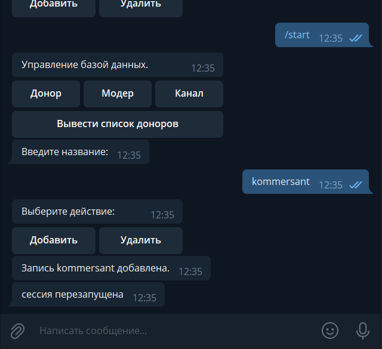
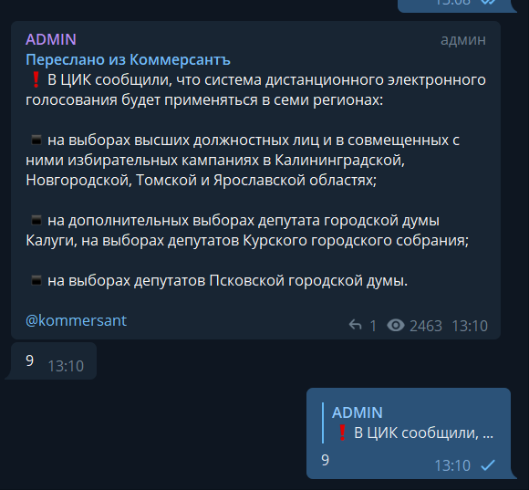
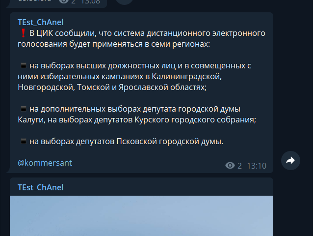

# TGgrabber

A simple container-based stack to manage a telegram channel

## Information

### Stack

- Docker swarm
- MySQL
- Python 3

### Used linux packages (will be installed automatically, using installation script)

```
docker
docker-compose
```

### Basic python requirements

```
aiogram==2.12.1 
configparser  
PyMySQL 
cryptography 
pycryptodome 
TgCrypto 
Pyrogram 
```

## Installation

1. **Clone this repo**
2. **Run installation bash script as followed:**

#### *Script required arguments:*

- **-i / --apiid** - user/bot api id. Can be optained at https://my.telegram.org/auth?to=apps
- **-h / --apihash** - user/bot api hash. Can be optained at https://my.telegram.org/auth?to=apps
- **-s / --stringsession** -user/bot session string. Can be optained using getsession.py script from this repo (require *api id* & *api hash*)
- **-d / --databasepassword** - mysql database root password. Also 'll be used as password for *grabber* mysql user
- **-u / --adminuserid** - telegram id of the user who will have access to the admin panel. Can be obtained using *@userinfobot* (telegram)
- **-t / --bottoken** - telegram bot token to be used as the admin panel. Can be obtained using *@BotFather* (telegram)
- **-r / --rtoken** - restart token for webhook auth

Script also contains debug messages to detect problem stage

3. **Check correctness of installation using the following command -** *sudo docker stack ls && sudo docker service ls*

(This step can be skipped in a full silent installation)

## Usage

The operation of the bot begins after setting up the desired channels in the admin panel. You must enter data about the moderation channel, the final channel, and at least one donor channel. After each change, the session of the main bot is restarted. After publishing a post in one of the donor channels, information about the post is sent to the moderation channel. To publish this entry in the final channel, you must send in response to the forwarded message from the donor channel its id, which is sent as the next message in the moderation channel.

### **Important**

#### **Bot needs admin rights in moder channel and result channel to work properly!**

### Usage Example (Screenshots)

#### Admin panel bot



#### Moderate channel



#### Result channel



## Related

This project based on this repo https://github.com/andreyru02/telegram-grabber
